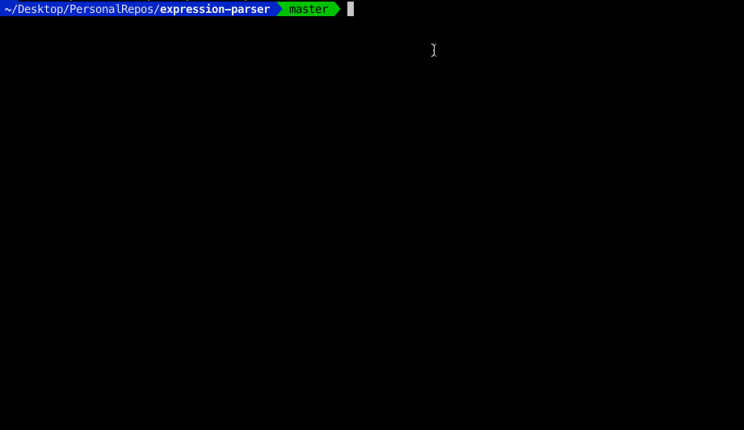

# expression-parser
Continuos REPL Parser for user defined expression (using [fastparse](http://www.lihaoyi.com/fastparse/))

#### Pre requisites:
* java - on Mac: `brew cask install adoptopenjdk8`
* sbt - on Mac: `brew install sbt`

#### Example expressions:
* `1.34 - 234.5 + 3443 ^ 2 + sqrt(69 - 5) * log(34)`
* `sqrt(3 ^ 2 + 4 ^ 2)`
* `sqrt(add(square(3), square(4)))`
* `add(12.0, 23, -1, 030, 343,23)`
* `quit` or `exit`

#### Run using:
`sbt run`

#### Create a standalone jar using:
`sbt assembly`

#### Preview

#### TODOs:
- [ ] Add invalid arguments error for functions.
- [ ] Add function name auto-completion.
- [ ] Add expression color highlighting (multi-color).
- [ ] Add expression history and ANSI console edit support.
